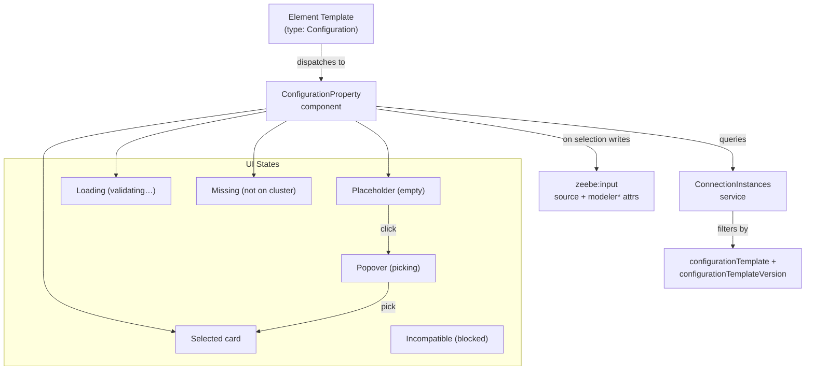
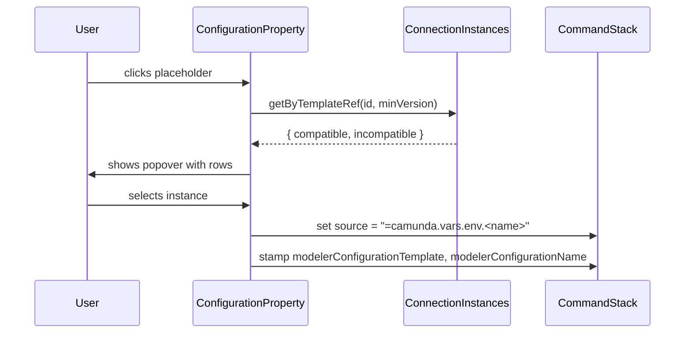

# Connection Chooser Prototype

Properties-panel picker for reusable connection instances. Stores selection as a FEEL expression + cached metadata on `zeebe:input`.

## Architecture



## Data Flow



## Element Template Schema

```json
{
  "configurationTemplates": [{
    "id": "io.camunda:slack-connection:1",
    "name": "Slack Connection",
    "version": 2,
    "properties": [{ "label": "Slack API Token", "type": "String", "binding": { "type": "zeebe:property", "name": "slackOauthToken" } }]
  }],
  "properties": [{
    "type": "Configuration",
    "configurationTemplate": "io.camunda:slack-connection:1",
    "configurationTemplateVersion": 2,
    "binding": { "name": "token", "type": "zeebe:input" }
  }]
}
```

- `configurationTemplate` — filters instances by this ID
- `configurationTemplateVersion` — minimum version floor; instances below are shown as "incompatible"
- `configurationTemplates` — embedded schema defining the JSON object stored server-side (Hub renders it; Modeler only uses `id`/`version` for filtering)

## BPMN XML Output

```xml
<zeebe:input source="=camunda.vars.env.slackProduction" target="token"
             modelerConfigurationTemplate="io.camunda:slack-connection:1"
             modelerConfigurationName="Slack Production" />
```

| Attribute | Purpose |
|-----------|---------|
| `source` | Runtime FEEL reference to cluster variable |
| `modelerConfigurationTemplate` | Design-time: chooser filter + validation |
| `modelerConfigurationName` | Design-time: offline display (cached) |

Engine ignores `modeler*` attributes.

## Key Implementation Details

**Dispatcher** routes to `ConfigurationProperty` when `type === 'Configuration'` or `configurationTemplate`/`templateRef`/`schemaRef` is present.

**ConnectionInstances service** — mock-backed registry populated via `setInstances()`. Fires `connectionInstances.changed` on update. `getByTemplateRef(id, minVersion)` splits results into `{ compatible, incompatible }`.

**Moddle extension** — adds `modelerConfigurationTemplate` and `modelerConfigurationName` as attributes on `zeebe:Input` and `zeebe:Property`. Merges into zeebe descriptor at runtime (production target: `zeebe-bpmn-moddle`).

**Cached name fallback** — when instances aren't loaded, reads `modelerConfigurationName` from the input element to show "Validating…" or "Not found on cluster".

**CreateHelper** — `createInputParameter` accepts `options.configurationTemplate` to stamp the attribute at creation time.

## Files

| Area | Path |
|------|------|
| Moddle | `src/cloud-element-templates/core/ZeebeModdleExtended.js` |
| Service | `src/cloud-element-templates/core/ConnectionInstances.js` |
| Component | `src/cloud-element-templates/properties-panel/properties/custom-properties/ConfigurationProperty.js` |
| Dispatcher | `src/cloud-element-templates/properties-panel/properties/custom-properties/index.js` |
| Setter | `src/cloud-element-templates/CreateHelper.js` |
| Styles | `assets/element-templates.css` |
| Fixture | `test/spec/cloud-element-templates/fixtures/connections-design.json` |
| Demo | `test/spec/Example.spec.js` |