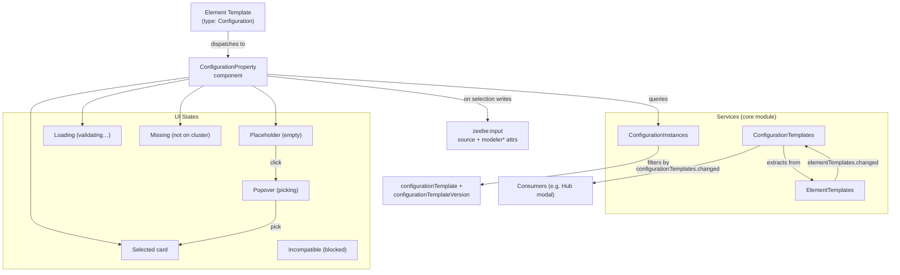
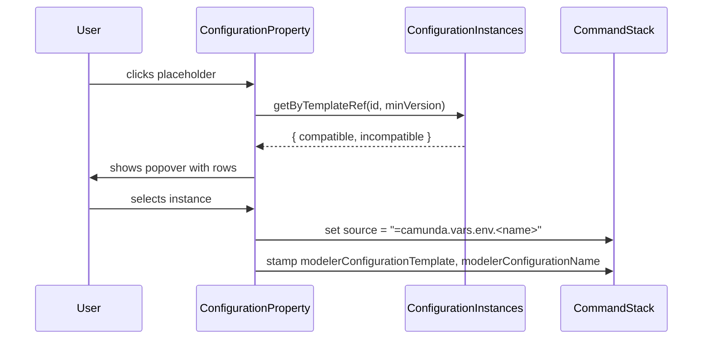
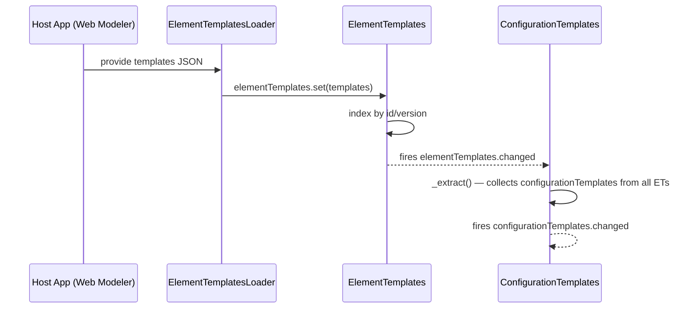
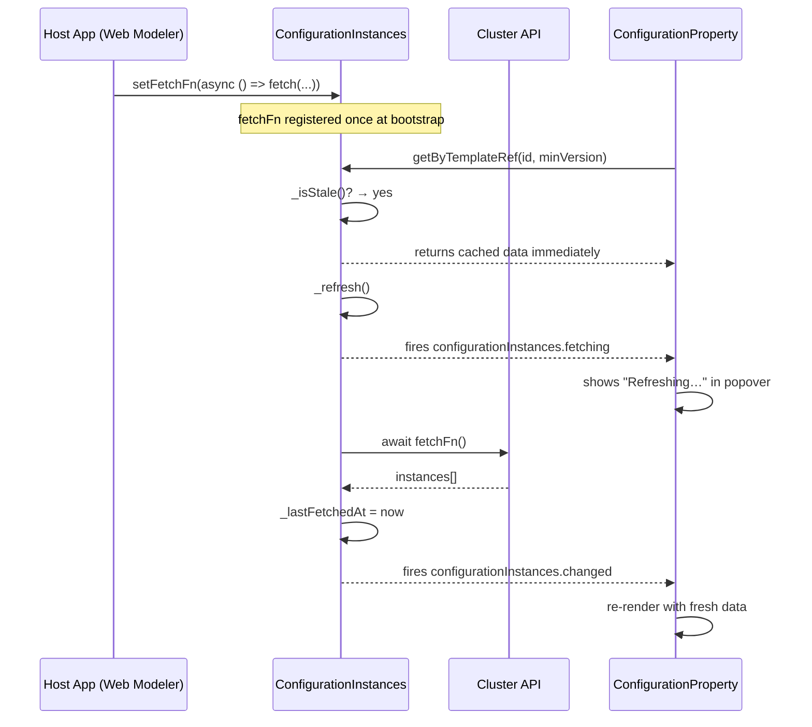

# Configuration Chooser Prototype

Properties-panel picker for reusable configuration instances. Stores selection as a FEEL expression + cached metadata on `zeebe:input`.

## Architecture



## Data Flow



## Bootstrap & Extraction Flow



`ElementTemplates.set()` is the trigger. It fires `elementTemplates.changed`, which `ConfigurationTemplates` listens to. No manual wiring needed — the core module registers `ConfigurationTemplates` in `__init__` so it subscribes on bootstrap.

## Configuration Instances Update Flow



### Caching Strategy

| Aspect | Behavior |
|--------|----------|
| Pattern | Stale-while-revalidate |
| TTL | Configurable via `config.configurationInstances.ttl` (default 30s) |
| Trigger | Lazy — `getAll()` / `getByTemplateRef()` check staleness |
| During refresh | Stale data served; popover shows "Refreshing…" |
| Force refresh | `invalidate()` — e.g. after creating an instance in Hub modal |
| Push fallback | `setInstances()` still works (tests, mocks); resets cache timestamp |

### Host App Setup

```js
const configurationInstances = modeler.get('configurationInstances');

configurationInstances.setFetchFn(async () => {
  const response = await fetch(`/clusters/${clusterId}/variables?kind=CREDENTIAL`);
  return response.json();
});
```

No polling or timers needed on the host side. The service handles refresh internally.

## Element Template Schema

```json
{
  "configurationTemplates": [{
    "id": "io.camunda:slack-connection:1",
    "name": "Slack Connection",
    "version": 2,
    "properties": [{ "label": "Slack API Token", "type": "String", "binding": { "type": "zeebe:property", "name": "slackOauthToken" } }]
  }],
  "properties": [{
    "type": "Configuration",
    "label": "Slack connection",
    "placeholder": "Select Slack connection",
    "configurationTemplate": "io.camunda:slack-connection:1",
    "configurationTemplateVersion": 2,
    "binding": { "name": "token", "type": "zeebe:input" }
  }]
}
```

- `placeholder` — author-controlled empty-state label for the chooser button (falls back to "Select configuration" if omitted)
- `configurationTemplate` — filters instances by this ID
- `configurationTemplateVersion` — minimum version floor; instances below are shown as "incompatible"
- `configurationTemplates` — embedded schema defining the JSON object stored server-side (Hub renders it; Modeler only uses `id`/`version` for filtering)

## BPMN XML Output

```xml
<zeebe:input source="=camunda.vars.env.slackProduction" target="token"
             modelerConfigurationTemplate="io.camunda:slack-connection:1"
             modelerConfigurationName="Slack Production" />
```

| Attribute | Purpose |
|-----------|---------|
| `source` | Runtime FEEL reference to cluster variable |
| `modelerConfigurationTemplate` | Design-time: chooser filter + validation |
| `modelerConfigurationName` | Design-time: offline display (cached) |

Engine ignores `modeler*` attributes.

## Key Implementation Details

**Dispatcher** routes to `ConfigurationProperty` when `type === 'Configuration'` or `configurationTemplate`/`templateRef`/`schemaRef` is present.

**ConfigurationTemplates service** — automatically extracts `configurationTemplates` from all element templates on `elementTemplates.changed`. Provides `get(id, version?)`, `getAll()`, `getLatest()`. Fires `configurationTemplates.changed`.

**ConfigurationInstances service** — stale-while-revalidate cache. Host registers a `fetchFn`; the service refreshes lazily on access when TTL expires. Fires `configurationInstances.fetching` (start) and `configurationInstances.changed` (done). `setInstances()` still works for push/mocking. API: `getAll()`, `getByTemplateRef(id, minVersion)`, `invalidate()`, `isFetching()`, `isLoaded()`.

**Moddle extension** — `modelerConfigurationTemplate` and `modelerConfigurationName` attributes on `zeebe:Input` and `zeebe:Property`. Lives upstream in [`zeebe-bpmn-moddle#configuration-template-support`](https://github.com/camunda/zeebe-bpmn-moddle/tree/configuration-template-support).

**Cached name fallback** — when instances aren't loaded, reads `modelerConfigurationName` from the input element to show "Validating…" or "Not found on cluster".

**CreateHelper** — `createInputParameter` accepts `options.configurationTemplate` to stamp the attribute at creation time.

## Files

| Area | Path |
|------|------|
| Moddle | `zeebe-bpmn-moddle` (branch: `configuration-template-support`) |
| Configuration Templates | `src/cloud-element-templates/core/ConfigurationTemplates.js` |
| Configuration Instances | `src/cloud-element-templates/core/ConfigurationInstances.js` |
| Core module | `src/cloud-element-templates/core/index.js` |
| Component | `src/cloud-element-templates/properties-panel/properties/custom-properties/ConfigurationProperty.js` |
| Dispatcher | `src/cloud-element-templates/properties-panel/properties/custom-properties/index.js` |
| Setter | `src/cloud-element-templates/CreateHelper.js` |
| Styles | `assets/element-templates.css` |
| Fixture | `test/spec/cloud-element-templates/fixtures/connections-design.json` |
| Tests | `test/spec/cloud-element-templates/ConfigurationTemplates.spec.js` |
| Demo | `test/spec/Example.spec.js` |