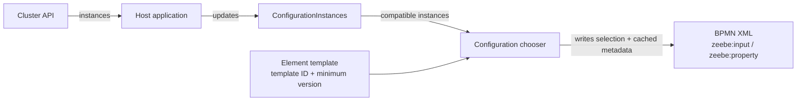
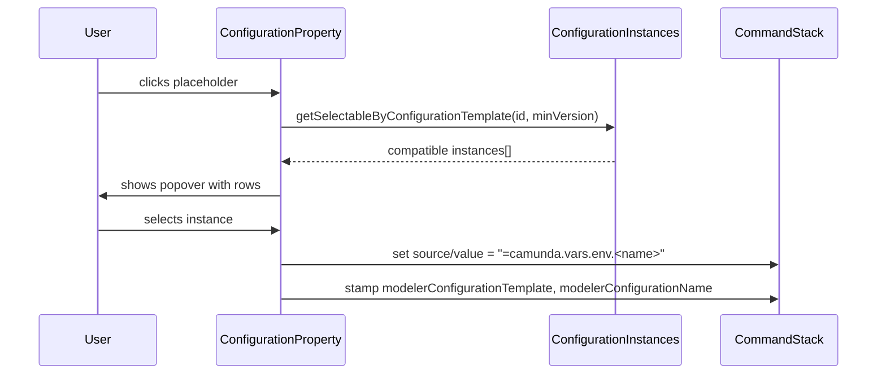
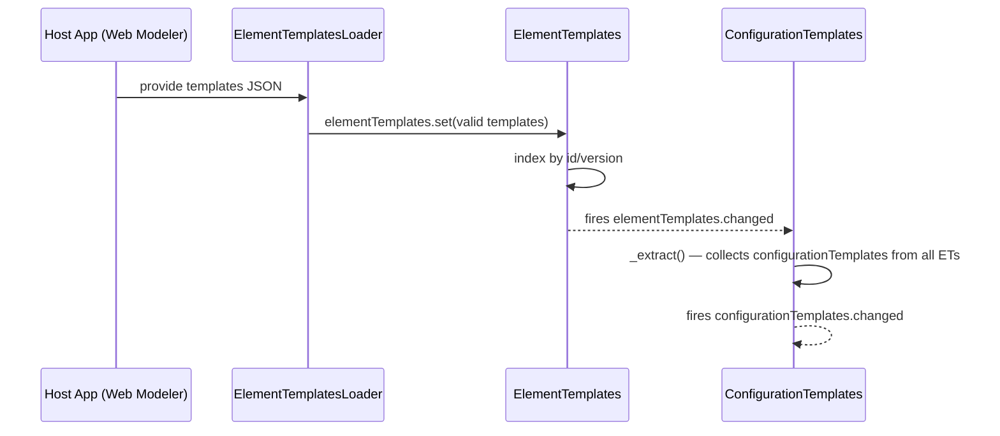
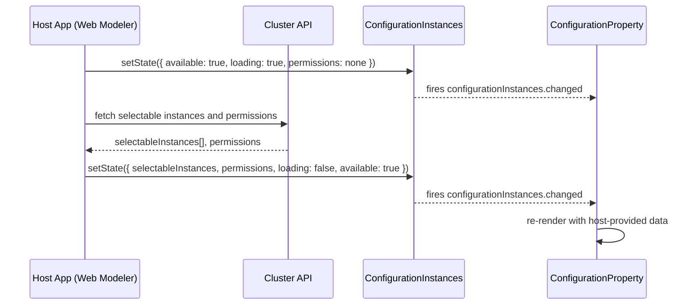

# Configuration Chooser Prototype

Properties-panel picker for reusable configuration instances. Stores selection as a FEEL expression and cached metadata on `zeebe:input` or `zeebe:property`.

## Architecture


```mermaid
flowchart LR
  API["Cluster API"] -->|instances| Host["Host application"]
  Host -->|updates| Registry["ConfigurationInstances"]
  Registry -->|compatible instances| Chooser["Configuration chooser"]
  Template["Element template<br/>template ID + minimum version"] --> Chooser
  Chooser -->|writes selection + cached metadata| BPMN["BPMN XML<br/>zeebe:input / zeebe:property"]
```

## Data Flow


```mermaid
sequenceDiagram
    participant User
    participant ConfigurationProperty
    participant ConfigurationInstances
    participant CommandStack

    User->>ConfigurationProperty: clicks placeholder
    ConfigurationProperty->>ConfigurationInstances: getSelectableByConfigurationTemplate(id, minVersion)
    ConfigurationInstances-->>ConfigurationProperty: compatible instances[]
    ConfigurationProperty->>User: shows popover with rows
    User->>ConfigurationProperty: selects instance
    ConfigurationProperty->>CommandStack: set source/value = "=camunda.vars.env.<name>"
    ConfigurationProperty->>CommandStack: stamp modelerConfigurationTemplate, modelerConfigurationName
```

## Bootstrap & Extraction Flow


```mermaid
sequenceDiagram
    participant Host as Host App (Web Modeler)
    participant ETL as ElementTemplatesLoader
    participant ET as ElementTemplates
    participant CT as ConfigurationTemplates

    Host->>ETL: provide templates JSON
    ETL->>ET: elementTemplates.set(valid templates)
    ET->>ET: index by id/version
    ET-->>CT: fires elementTemplates.changed
    CT->>CT: _extract() — collects configurationTemplates from all ETs
    CT-->>CT: fires configurationTemplates.changed
```

`ElementTemplates.set()` is the trigger. It fires `elementTemplates.changed`, which `ConfigurationTemplates` listens to. No manual wiring needed — the core module registers `ConfigurationTemplates` in `__init__` so it subscribes on bootstrap.

## Configuration Instances Update Flow


```mermaid
sequenceDiagram
    participant Host as Host App (Web Modeler)
    participant ClusterAPI as Cluster API
    participant CI as ConfigurationInstances
    participant CP as ConfigurationProperty

    Host->>CI: setState({ available: true, loading: true, permissions: none })
    CI-->>CP: fires configurationInstances.changed
    Host->>ClusterAPI: fetch selectable instances and permissions
    ClusterAPI-->>Host: selectableInstances[], permissions
    Host->>CI: setState({ selectableInstances, permissions, loading: false, available: true })
    CI-->>CP: fires configurationInstances.changed
    CP->>CP: re-render with host-provided data
```

### Host App Setup

```js
const configurationInstances = modeler.get('configurationInstances');

async function refreshConfigurations() {
  configurationInstances.setState({
    available: true,
    loading: true,
    error: false,
    permissions: {
      create: false,
      update: false
    }
  });

  try {
    const [ response, permissions ] = await Promise.all([
      fetch(`/clusters/${clusterId}/variables?kind=CREDENTIAL`),
      getConfigurationPermissions(clusterId)
    ]);
    const { items } = await response.json();

    configurationInstances.setState({
      selectableInstances: items,
      loading: false,
      error: false,
      available: true,
      permissions
    });
  } catch (error) {
    configurationInstances.setState({
      selectableInstances: [],
      loading: false,
      error: true,
      available: true,
      permissions: {
        create: false,
        update: false
      }
    });
    throw error;
  }
}

function clearUnavailableConfigurations() {
  configurationInstances.setState({
    selectableInstances: [],
    loading: false,
    error: false,
    available: false,
    unavailableMessage: 'No cluster selected'
  });
}
```

The host owns fetching, caching, refresh timing, errors, availability, access-token handling, unavailable-state copy, and mapping the cluster authorization response to `{ create, update }`. It passes the compatible cluster-variable search result `items` as `selectableInstances` without flattening their `metadata`. `ConfigurationInstances` stores the latest host-provided selectable configurations plus loading, error, availability, and permission state, filters template-derived configurations using the presence of `metadata.kind`, `metadata.configurationTemplate`, and `metadata.configurationTemplateVersion`, and emits `configurationInstances.changed` after every state update. Permissions default to `false`; an open `c8run` host explicitly supplies `{ create: true, update: true }`. When configurations are unavailable, the host clears the list, sets `available: false`, and provides `unavailableMessage`; the registry clears errors and permissions and the chooser shows a cached selection without claiming it is missing. A failed fetch sets `error: true`, clears selectable configurations and permissions, and shows "Could not load configurations": on an unbound property, as inline status beneath the disabled chooser; on a bound property, as its configuration card. Selection and cluster-backed management actions remain unavailable until a successful refresh clears the error; removing the local BPMN binding remains available.

### Chooser States

Registry-level states are shown beneath an unbound chooser; binding-level states are shown in its configuration card.

| State | Condition | Representation |
| --- | --- | --- |
| Ready | No binding; configurations are available | Enabled "Choose configuration" placeholder |
| Available choices | Chooser is open with compatible instances | Popover listing compatible configurations |
| No compatible choices | Chooser is open; loaded list is empty | "No compatible configurations are available in the connected cluster" |
| Loading | Refresh in progress | Loading indicator in the popover; an unresolved binding shows "Loading configuration" |
| Unavailable | No cluster or integration is unavailable | Disabled placeholder plus host-provided unavailable message; a bound configuration remains visible offline |
| Fetch error | Configuration fetch failed | Disabled placeholder plus "Could not load configurations"; a bound configuration shows the same error in its card |
| Selected | Binding resolves to a compatible instance | Configuration card with display and variable names |
| Missing | Bound instance is absent after a successful fetch | Warning card with "Not found on cluster" |
| Incompatible type | Bound instance has a different template ID | Warning card with "Incompatible configuration type" |
| Version too old | Bound instance is below the required version | Warning card with actual and required versions; **Upgrade** is available with update permission |

The chooser exposes **Create** when the host grants create permission, **Edit** for a compatible selected instance when it grants update permission, and always allows removing the local BPMN binding.

For configurations already referenced by BPMN, the host fetches records directly by cluster-variable name and provides them via `setReferencedInstances()` (or `setState({ referencedInstances })`). These records are used by `getReferencedInstanceByName()` only and are intentionally separate from the selectable list.

### Host Integration Pattern: Selectable + Referenced Configurations

Use two data channels:

1. `selectableInstances` from the compatible search query
2. `referencedInstances` from direct by-name fetches for currently bound BPMN references

```js
async function refreshConfigurationRegistry(clusterId, boundNames) {
  configurationInstances.setState({
    loading: true,
    error: false,
    available: true,
    permissions: {
      create: false,
      update: false
    }
  });

  try {
    const [ listResponse, permissions, referencedInstances ] = await Promise.all([
      // Compatible chooser rows only (kind/template/floor filtered)
      fetch(`/clusters/${clusterId}/variables/search?kind=CREDENTIAL`),
      getConfigurationPermissions(clusterId),
      // Already-bound records by name (may be incompatible)
      Promise.all(boundNames.map((name) => getClusterVariableByName(clusterId, name)))
    ]);

    const { items } = await listResponse.json();

    configurationInstances.setState({
      selectableInstances: items,
      referencedInstances: referencedInstances.filter(Boolean),
      loading: false,
      error: false,
      available: true,
      permissions
    });
  } catch (error) {
    configurationInstances.setState({
      selectableInstances: [],
      referencedInstances: [],
      loading: false,
      error: true,
      available: true,
      permissions: {
        create: false,
        update: false
      }
    });

    throw error;
  }
}
```

This keeps the chooser list strictly compatible while still allowing `getReferencedInstanceByName()` to explain and act on a BPMN-referenced incompatible configuration (type mismatch or below-floor version).

The chooser label resolves from the element-template property `label`, falling back to the referenced configuration template's required `name`. The resolved label provides context in the unselected state, for example "Choose AWS Credential". The empty state is generic: "No compatible configurations are available in the connected cluster". An incompatible bound instance retains its own display name as the title; a generic subtitle explains whether its configuration type or version is incompatible.

Cached `modelerConfigurationTemplate` and `modelerConfigurationName` attributes exist only while the binding contains a configuration reference. Removing a selection clears both attributes; optional bindings are removed entirely, while non-optional bindings retain only their empty runtime value.

### Create Configuration Event

When the user clicks **Create configuration**, the chooser fires `configuration.create` on the modeler's event bus. The host application handles the event and opens its configuration editor.

```js
eventBus.on('configuration.create', ({
  element,
  property,
  configurationTemplate,
  configurationTemplateVersion
}) => {
  // Open a creation modal for the requested template.
});
```

After a successful write, the host fires `configuration.created` with the original `element` and `property` plus the created API-shaped `instance`:

```js
eventBus.fire('configuration.created', {
  element,
  property,
  instance
});
```

The originating chooser verifies the instance kind, template ID, and version floor, then writes its FEEL reference and cached metadata into BPMN. Unrelated or incompatible completion events are ignored. The host still refreshes `ConfigurationInstances` so the created instance is available in the selectable list; selection itself does not wait for that refresh.

The chooser exposes instance selection when a cluster is selected and creation when the host additionally grants `permissions.create`. Offline, a cached selection can only be removed.

### Edit and Upgrade Configuration Events

With `permissions.update`, the context menu exposes **Edit** for a compatible selected instance and fires `configuration.edit`. For a resolved bound instance below the chooser's version floor, it exposes **Upgrade** and fires `configuration.upgrade`. Both events carry `{ element, property, instance, configurationTemplate, configurationTemplateVersion }`; the host opens the appropriate editor, fetches the full value, writes the update, and refreshes the registry.

The compatible search response does not include a BPMN-referenced configuration with the wrong configuration template or a version below the floor. The host therefore fetches it directly by cluster-variable name and passes that record through `setReferencedInstances()` (or `setState({ referencedInstances })`). `getSelectableByConfigurationTemplate()` continues to exclude it from the selectable list, while `getReferencedInstanceByName()` lets the chooser identify and explain the incompatible binding. A wrong-template instance shows "Incompatible configuration type" and cannot be upgraded; a matching instance below the floor shows its version mismatch and offers Upgrade when permitted. If the host has not fetched the referenced configuration, the chooser retains the generic missing state and does not offer Upgrade.

## Element Template Schema

```json
{
  "configurationTemplates": [{
    "id": "io.camunda:slack-connection:1",
    "name": "Slack Connection",
    "version": 2,
    "kind": "CREDENTIAL",
    "properties": [{ "label": "Slack API Token", "type": "String", "binding": { "type": "property", "name": "slackOauthToken" } }]
  }],
  "properties": [{
    "type": "Configuration",
    "label": "Slack connection",
    "configurationTemplate": "io.camunda:slack-connection:1",
    "configurationTemplateVersion": 2,
    "binding": { "name": "configuration", "type": "zeebe:input" }
  }]
}
```

- `configurationTemplate` — filters instances by this ID
- `configurationTemplateVersion` — minimum version floor; instances below are excluded
- `configurationTemplates` — embedded schema defining the JSON object stored server-side (Hub renders it; Modeler only uses `id`/`version` for filtering)

`Configuration` properties require a non-empty `configurationTemplate` and a `zeebe:input` or `zeebe:property` binding with a name. Embedded configuration templates require non-empty `id`, `name`, and `kind` fields plus a `properties` array. Invalid element templates are reported and not registered.

## BPMN XML Output

For an outbound connector, the chooser writes a `zeebe:input`:

```xml
<zeebe:input source="=camunda.vars.env.slackProduction" target="configuration"
             modelerConfigurationTemplate="io.camunda:slack-connection:1"
             modelerConfigurationName="Slack Production" />
```

For an inbound connector, it writes a `zeebe:property`:

```xml
<zeebe:property name="configuration" value="=camunda.vars.env.slackProduction"
                modelerConfigurationTemplate="io.camunda:slack-connection:1"
                modelerConfigurationName="Slack Production" />
```

Both binding types carry the same modeler metadata:

| Attribute | Purpose |
|-----------|---------|
| `source` / `value` | Runtime FEEL reference to cluster variable (`source` on `zeebe:input`, `value` on `zeebe:property`) |
| `modelerConfigurationTemplate` | Design-time: chooser filter + validation |
| `modelerConfigurationName` | Design-time: offline display (cached) |

Engine ignores `modeler*` attributes.

## Key Implementation Details

**Dispatcher** routes to `ConfigurationProperty` when `type === 'Configuration'`.

**ConfigurationTemplates service** — automatically extracts `configurationTemplates` from all element templates on `elementTemplates.changed`. Provides `get(id, version?)`, `getAll()`, `getLatest()`. Fires `configurationTemplates.changed`.

**ConfigurationInstances service** — host-fed instance registry. The host calls `setLoading()`, `setSelectableInstances()`, `setReferencedInstances()`, or atomic `setState({ selectableInstances, referencedInstances, loading, error, available, unavailableMessage, permissions })`; the service fires `configurationInstances.changed` and exposes `getSelectableInstances()`, `getSelectableByConfigurationTemplate(id, minVersion)`, `getReferencedInstanceByName(name)`, `isLoading()`, `hasError()`, `isAvailable()`, `getUnavailableMessage()`, `canCreate()`, and `canUpdate()` for consumers. `referencedInstances` are used only for direct by-name lookups and never become selectable rows. When unavailable, the registry clears errors, permissions, and referenced instances.

**Moddle extension** — `modelerConfigurationTemplate` and `modelerConfigurationName` attributes on `zeebe:Input` and `zeebe:Property`. Lives upstream in [`zeebe-bpmn-moddle#configuration-template-support`](https://github.com/camunda/zeebe-bpmn-moddle/tree/configuration-template-support).

**Cached name fallback** — while the host reports loading, reads `modelerConfigurationName` from the binding element to show the cached name with "Loading...". Once loading is false and the instance is absent, it shows "Not found on cluster".

**ConfigurationProperty** — stamps `modelerConfigurationTemplate` and `modelerConfigurationName` after creating or updating either a `zeebe:Input` or `zeebe:Property` binding.

## Files

| Area | Path |
|------|------|
| Moddle | `zeebe-bpmn-moddle` (branch: `configuration-template-support`) |
| Configuration Templates | `src/cloud-element-templates/core/ConfigurationTemplates.js` |
| Configuration Instances | `src/cloud-element-templates/core/ConfigurationInstances.js` |
| Core module | `src/cloud-element-templates/core/index.js` |
| Component | `src/cloud-element-templates/properties-panel/properties/custom-properties/ConfigurationProperty.js` |
| Dispatcher | `src/cloud-element-templates/properties-panel/properties/custom-properties/index.js` |
| Setter | `src/cloud-element-templates/CreateHelper.js` |
| Styles | `assets/element-templates.css` |
| Fixture | `test/spec/cloud-element-templates/fixtures/connections-design.json` |
| Tests | `test/spec/cloud-element-templates/ConfigurationTemplates.spec.js` |
| Demo | `test/spec/Example.spec.js` |